  

---
🎓 Student • 💻 Aspiring Security Researcher • 🐧 Linux & 🐍 Python Enthusiast 

### *I like breaking things. And building the tools to break them better.*

I'm currently diving into:
- 🔐 Offensive Security, Red Teaming & Pentesting  
- 🧩 Self-hosted tools

I love Docker 🐳

---

## 🧰 Skills

---

## 📊 GitHub Stats

---
